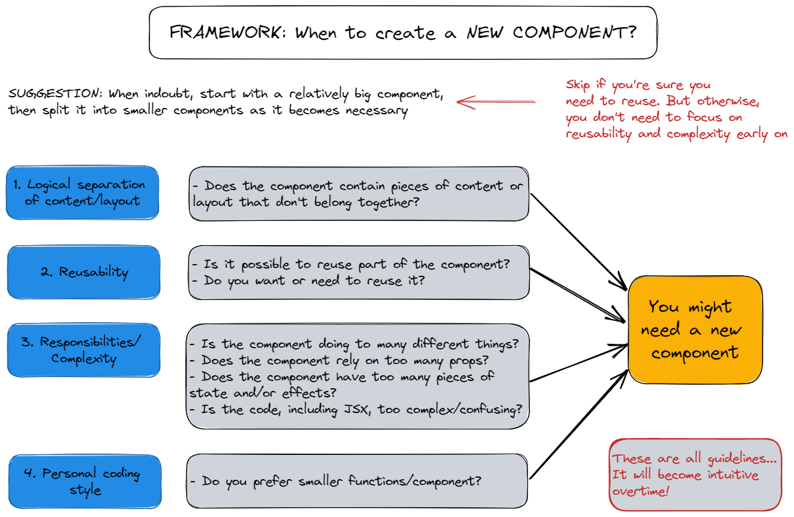

# React JS Learning Projects

## Definition

### What is React ?

- React is component-based, declarative, state-driven javascript library for building user interface
- React Frameworks build on top of React library (NEXT.js, Remix).
- Component (Data, Logic, Appearance).

### What is JSX ?

- Declarative syntax to describe what component look like and how they work
- Component must return a block of JSX
- Extension of Javascript CSS and React components into HTML
- Each JSX element is converted to a `React.createElement` function call.
- We could use React without JSX.

> Note: JS uses imperative way:
>
> - Manual DOM element selections and DOM traversing
> - Step-by-step DOM mutations until we reach the desired UI
>
> React uses Declarative way:
>
> - Describe what UI should look like using JSX, based on current data.
> - React is an abstraction away from DOM: we never touch the DOM.
> - Instead, we think of the UI as a reflection of the current data.

### Rules of JSX

- JSX works essentially like HTML, but we can enter "JS mode" by using `{}` (for text or attributes).
- We can place JS expressions inside `{}`. Examples: reference variables, create arrays or objects, [].map(), ternary operator.
- Statements are not allowed (if/else, for, switch).
- JSX produces a JS expression.

1. We can place other pieces of JSX inside `{}`.
2. We can write JSX anywhere inside a component (in if/else, assign to variables, pass it into functions).

- A piece of JSX can only have one root element. If you need more, use `React.Fragment` (or the short <>).

### Separations of Concerns

- One component per file
- Component combines of JS, HTML, CSS

### What is Props ?

- A communication channel between parent and child components.
- Use to pass data from parent components to child components (down the component tree).
- Essential tool to configure and customize components (like function parameters).
- With props, parent components control how child components look and work.
- Anything can be passed as props: single values, arrays, objects, functions, even other components.

> Note
>
> - Component data is made of props and state
> - State is internal data that can be updated by the component's logic
> - Props is data coming from the outside, and can only be updated by the parent component.
>
> => Props are read-only, they are immutable! This is one of React's strict rules.
>
> => If you need to mutate props, you actually need state.
>
> Why ?
>
> - Mutating props would affect parent, creating side effects (not pure).
> - Components have to be pure function in terms of props and state.
> - This allows React to optimize apps, avoid bugs, make apps predictable.

### One-Way Data Flow

- Data can only be passed from parents to child components, which happens by using props. In other words, data can flow from parent to children but never the opposite way.
- Makes applications more predictable and easier to understand.
- Makes applications easier to debug, as we have more control over the data.
- More performance.

### What is State ?

- Data that a component can hold over time, necessary for information that it needs to remember throughout the app's lifecycle.
- Component's memory.
- State variable / piece of state: A single variable in a component (component state).
- Updating component state triggers React to re-render the component.

> State allows developers to:
>
> - Update the component's view (by re-rendering it)
> - Persist local variables between renders

> One Component, One State
>
> Each component has and manages its own state, no matter how many times we render the same component.

> UI as a Function of state
>
> ` UI = f(state )`
>
> - With state, we view UI as a reflection of data changing over time
> - We describe reflection of data using state, event handlers, and JSX

> In PRACTICAL terms
>
> - Use a state varifable for any data that the component should keep track of `("remember")` over time. This is data that will change at some point. In Vanilla JS, that's let variable, or an `[]` or `{}`.
> - Whenever you want something in the component to be dynamic, create a piece of state related to that `thing`, and update the state when the `thing` should change (aka `be dynamic`)
>
> Example: A modal window can be open or closed. So we create a state variable `isOpen` that tracks whether the modal is open or not. On `isOpen = true` we display the window, on `isOpen = false` we hide it.
>
> - If you want to change the way a component looks, or the data it displays, `update its state`. This usually happens in an `event handler` function.
> - When building a component, imagine its view as a `reflection of state changing over time`.
> - For data that should not trigger component re-renders, `don't use state`. Use a regular variable instead. This is a common `beginner mistake`.

### State vs Props

| State                                        | Props                                                                                                 |
| -------------------------------------------- | ----------------------------------------------------------------------------------------------------- |
| Internal data, owned by component            | External data, owned by parent component                                                              |
| Component `memory`                           | Similar to function parameters                                                                        |
| Can be updated by the component itself       | Read-only                                                                                             |
| Updating state causes component to re-render | `Receiving new props causes component to re-render`. Usually when the parent's state has been updated |
| Used to make components interactive          | Used by parent to configure child component ("settings")                                              |

### The `THINKING IN REACT` process

- Break the desired UI into `components` and establish the `component tree`.
- Build a `static` version in React (without state)
- Think about `state`:

  1. When to use state
  2. Types of state: local vs global
  3. Where to place each piece of state

- Establish `data flow`:

  1. One-way data flow
  2. Child-to-parent communication
  3. Accessing global state

### What is State management ?

- Deciding `when` to create pieces of state, what `types` of state are necessary, `where` to place each piece of state, and how data `flows` through the app.

> Giving each piece of state a `home`

| Local State                                                                                                                  | Global State                                                                     |
| ---------------------------------------------------------------------------------------------------------------------------- | -------------------------------------------------------------------------------- |
| State needed `only by one or few components`                                                                                 | State that `many components` might need                                          |
| State that is defined in a component and `only that component and child components` have access to it (by passing via props) | `Shared` state that is accessible to `every component` in the entire application |

### STATE: `WHEN` AND `WHERE`


> LIFTING STATE UP
>
> - By `lifting state up`, we have sucessfully `shared` one piece of state with multiple components in `different positions` in the component tree
>
> - `Child-to-parent communication (inverse data flow)`: child updating parent state (data "flowing" up)

> DERIVING STATTE
>
> - State that is computed from an existing piece of state or from props
> - Just regular variables, no `useState`
> - cart state is the `single source of truth` for this related data
> - Works because re-rendering component will `automatically re-calculate` derived state

### COMPONENT SIZE MATTERS


> The 4 criteria for splitting a UI into components:
>
> 1. Logical separation of content/layout.
> 2. Reusability
> 3. Responsibilities/complexity
> 4. Personal coding style

### FRAMEWORK: When to create a NEW COMPONENT



> Some more general guidelines:
>
> - Be aware that creating a new component `creates a new abstraction`. Abstractions have a `cost`, because `more abstractions require more mental energy` to switch back and forth between components. So try not to create new components too early.
> - Name a component according to `what it does` or `what it displays`. Don't be afraid of using long component name.
> - Never declare a new component `inside another component`.
> - `Co-locate related components inside the same file`. Don't separate components into different files too early.
>
> -> It's completely normal that an app has components of many different sizes, including very small and huge ones.
> 

### COMPONENT CATEGORIES


### What is COMPONENT COMPOSITION?

- Combining different components using the `children` prop (or explicitly defined props)

> With COMPONENT COMPOSITION, WE CAN:
>
> 1. Create highly reusable and flexible components.
> 2. Fix prop drilling (great for layouts)

### COMPONENT vs INSTANCE vs ELEMENT


### [2] RENDER PHASE


## Git

```
1. https://github.com/jonasschmedtmann/ultimate-react-course
2. https://github.com/hiepnhse61627/ReactJS
```

## Setup Development Environment

```
Go to Visual Studio Code Settings, then search for the following:

1. Auto save -> onFocusChange
2. Default formattter -> Prettier
3. Format On Save -> Turn on
4. Eslint -> onSave
5. Diff decorations -> Change to "None" if you don't want VSCode shows changes for Git
```

## Setting up a project with Create React App

```
npx create-react-app@5 {project-name}
```

## Useful Resources

- [Writing Resilient Components](https://overreacted.io/writing-resilient-components/?ref=jonas.io) (By Dan Abramov from the React team)
- [Things I think about when I write React code](https://github.com/mithi/react-philosophies?ref=jonas.io)
- [A (Mostly) Complete Guide to React Rendering Behavior](https://blog.isquaredsoftware.com/2020/05/blogged-answers-a-mostly-complete-guide-to-react-rendering-behavior/?ref=jonas.io) (By Mark Erikson from the redux team)
- [A Visual Guide to React Rendering](https://alexsidorenko.com/blog/react-render-always-rerenders/?ref=jonas.io)
- [Inside Fiber: in-depth overview of the new reconciliation algorithm in React](https://indepth.dev/posts/1008/inside-fiber-in-depth-overview-of-the-new-reconciliation-algorithm-in-react?ref=jonas.io)
- [A Cartoon Intro to Fiber](https://www.youtube.com/watch?v=ZCuYPiUIONs?ref=jonas.io)
- [What Is React Fiber? React.js Deep Dive](https://www.youtube.com/watch?v=0ympFIwQFJw?ref=jonas.io)
- [The React and React Native Event System Explained](https://levelup.gitconnected.com/how-exactly-does-react-handles-events-71e8b5e359f2?ref=jonas.io)
- [Under the hood of event listeners in React](https://gist.github.com/romain-trotard/76313af8170809970daa7ff9d87b0dd5?ref=jonas.io)
- [A DIY guide to build your own React](https://github.com/pomber/didact?ref=jonas.io)
- [useSyncExternalStore First Look](https://julesblom.com/writing/usesyncexternalstore?ref=jonas.io)
- [Under the hood of React's hooks system](https://the-guild.dev/blog/react-hooks-system?ref=jonas.io)
- [Why Do React Hooks Rely on Call Order?](https://overreacted.io/why-do-hooks-rely-on-call-order/?ref=jonas.io)
- [So you think you know everything about React refs](https://blog.thoughtspile.tech/2021/05/17/everything-about-react-refs/?ref=jonas.io)
- [react-use: Reusable React Hook Library](https://github.com/streamich/react-use?ref=jonas.io)
- [react-hookz: React hooks done right](https://github.com/react-hookz/web?ref=jonas.io)
